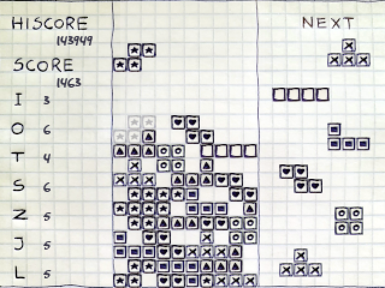
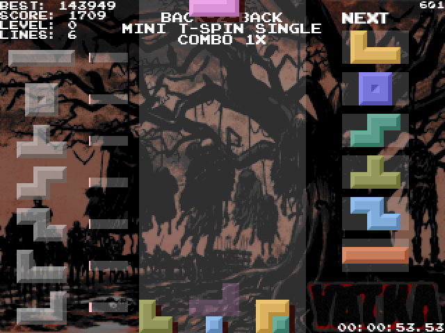

## YATKA
yet another tetris klone in action

### description
YATKA is one of many Tetris implementations available. Motivation behind this one was, on the one hand, to create a game that would conform to modern rules of the game, while, on the other, to make possible running it on resource-limited platforms (e.g. Bittboy or JZ4760-based handheld consoles). This is the reason I use SDL 1.2, which is considered outdated, or develop my own simplistic solutions instead of relying on third-party dependencies.

The game is in constant development. Feel free to report errors as it helps to improve the game. There are no full-time testers working on it so I appreciate any feedback.

### features
* skin system - you can choose a visual style according to your taste from a set of predefined skins or create your own,
* music playback - you can listen to the tracks included in the game or provide your own songs,
* Super Rotation System - you can use sophisticated tactics known from the modern versions of Tetris,
* low hardware requirements - the game can run on devices without accelerated graphics as it was developed using SDL 1.2, a time-proven multimedia library,
* multi-platform design - the game can be easily ported to any operating system supporting a limited set of dependencies required by YATKA,
* customizable rules - you can change parameters affecting the tetromino generator, lock delay or easy spin, even during the game.

### how to build (Ubuntu)
    apt update
    apt install libsdl-image1.2-dev libsdl-mixer1.2-dev libsdl-ttf2.0-dev libsdl1.2-dev
    git clone https://github.com/szymor/yatka.git
    cd yatka
    make

### command line parameters
- --nosound - disable music and sound effects
- --sound - enable music and sound effects if disabled
- --fullscreen - full screen mode
- --scale1x - 320x240 mode
- --scale2x - 640x480 mode
- --scale3x - 960x720 mode
- --scale4x - 1280x960 mode
- --startlevel <num> - the higher level, the higher speed

For more, please refer to the source code.

### custom skins
The easiest way to start your journey with creating skins is as follows:
1. Go to skins/ in the game directory. Note that if you use a packed version of the game (e.g. you use OPK), you cannot enter the game directory without extracting the archive.
2. Copy one of existing skin directories and rename it, e.g. duplicate default/ in skins/ and rename it to 'myownskin'.
3. Replace the background file (usually named 'bg.png') with your custom picture.
4. Modify 'game.txt' in the skin directory according to your needs. You can customize many parameters of the skin in there, e.g. tetromino colors, ghost piece, text strings, display of statistics, etc. Look at the existing skins for available options.

If you use a packed (OPK) version of the game, it may be easier for you to copy your custom skins to .yatka/skins/ in your home directory (instead of skins/ in the game directory). Create it if it does not exist.

### custom music support
The game supports custom music playback. In order to listen to your favourite songs, you need to copy them to $HOME/.yatka/music. If the folder does not exist, create it. Supported music formats depend on your platform, but usually MOD, MP3, OGG and WAV files are accepted.

### randomizers
As noted before, YATKA offers several randomizers to choose among. Selection of a randomizer affects gameplay as some randomizers tend to generate tetromino sequences difficult to play with. On the contrary, others may generate predictable patterns and therefore offer no challenge to the player.

Currently the following randomizers are supported:
* naive (unbiased) - each piece is generated independently on each other using a standard pseudo random number generator. It can lead to non-trivial sequences and uneven distribution of tetrominoes.
* nintendo - a slightly improved variant of the above, used in Nintendo's NES Tetris (hence the name). If the generated piece is the same as the last one, it is generated once more (and only once) and dealt. It helps to avoid issues with the same consecutive pieces, but other issues stay unresolved in regard to the previous randomizer.
* 7bag - a bag of seven different pieces in a random order is generated. The generated pieces are dealt consecutively until the bag is empty. After that the bag is generated again and the cycle repeats forever. It solves some issues with pieces appearing too often or too seldom, but at the same time it makes the game very predictable.
* 8bag - a variant of the above, it uses a bag of eight, instead of seven, pieces. It introduces more variation in distribution of pieces, because one of the pieces in the bag repeats.
* 14bag - similar to 7bag, but the cycle is longer.
* tgm98 - the randomizer with history of 4 pieces instead of one (as it was with the nintendo randomizer).
* tgm3 - the most complex randomizer implemented so far. In order to fully grasp the idea, I recommend to take a glimpse into the source code or read the article on randomizers by Simon Laroche (the link is in 'about...' section).

I do not cover the topic in detail because there are many better sources on that.

### about authors/contributors
- gfx and code (mostly) by me (vamastah a.k.a. szymor)
- frame limiting, counting and upscaling code by Artur 'zear' Rojek
- in-game music by Vomitron
- some tetromino randomizers thanks to Simon Laroche ([link](https://simon.lc/the-history-of-tetris-randomizers))
- SRS wall kicks thanks to [Tetris Wiki](https://tetris.fandom.com/wiki/SRS)
- Elektronika60, Dotkom and Gamboi skins by GuineaSquiggle

### ideas / plans
- line clear animation (TGM?)
- ports for other platforms
- better joystick support
- advanced hiscore system (best score in Marathon/Ultra, best time in Sprint, best lines in Ultra)
- another implementation of hold (as an option) with a separate slot for a tetromino
- new KiCAD skin with no tetromino stats (I got bored with them)
- some kind of system promoting sponsoring the project (sponsor-defined wishes shown during gameplay?)
- new sound effects
- option to imitate playing multiplayer mode (dynamic debris generation during gameplay)

### sponsors
- Saikazu
